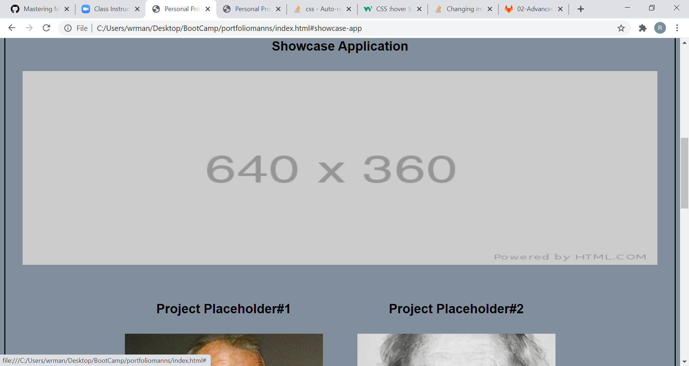

# portfoliomanns
Personal Portfolio

Creating page to host personal info, contact info, resume, and projects.

Created nav bar with in-page links to sections About Me, Work/Projects, Contact Info, Resume/Working Languages.

Used placeholders for structure and sizing in sections.

Added placeholder links for applications and projects

Made the 'Showcase Application' behave like a banner on top of the other projects

Added a placeholder section for resume

Made 'Contact' clickable links

Link to page: https://wrmanns.github.io/portfoliomanns/

